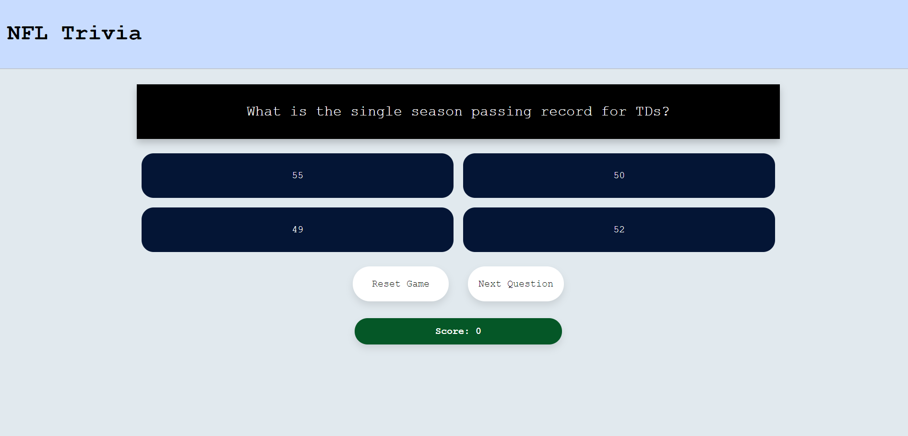

# MohitTham.github.io
## Trivia Game 

### Wireframes
A Football trivia gamed designed to test your knowledge in the NFL. Our users are avid NFL watchers.
Here in this application we present 5 questions to the user with a scoring system designed to penalize the user everytime they get an answer wrong. 
Users will want to be challanged with these questions and be able to see thier score once completed.
In this project I strived to create an easy on the eye visual experience while adding some flavor with a dynamic scoring options that is explained below.

### Game Rules
The user has the ability to select from 4 options. 
Everytime the user selects the correct add .nswer first try they are rewarded 100 points.
Clicking 1 wrong answer followed by the correct answer awards 50 points. 
Clicking 2 wrong answers followed by the correct answer awards 25 points.

### Features
This program implements a feature for clicking the next question, a feature for resetting the game and also a trigger feature that checks to see when the last question has been reached and makes the final score a larger visual for the user to see clearly.

### Technologies Used
- Javascript
- HTML
- CSS

